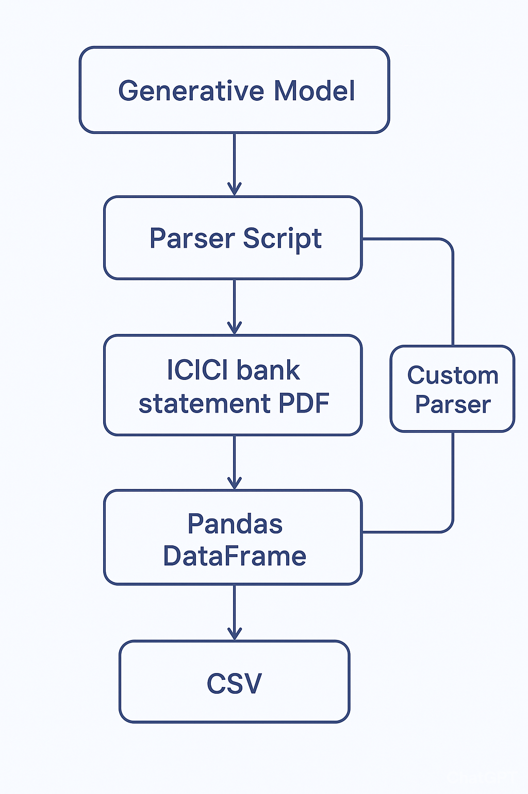

# Bank Statement PDF Parser Agent

This project is a Python-based agent designed to parse bank statement PDFs and extract transaction data into a structured pandas DataFrame. The agent handles variations in PDF formatting, consolidates split rows, and correctly classifies amounts as Debit or Credit using clustering and fallback logic.

---

## Features

- **PDF Parsing:** Uses `pdfplumber` to extract words and their coordinates.
- **Word Normalization:** Ensures consistent coordinates (`x_left`, `x_right`, `y_top`, `y_bottom`, `x_center`) for robust row detection.
- **Row Grouping:** Groups words into rows based on vertical positions with tolerance.
- **Transaction Extraction:**
  - Detects transaction `Date` in `DD-MM-YYYY` format.
  - Extracts numeric tokens for `Amount` and `Balance`.
  - Uses KMeans clustering to determine `Debit Amt` vs `Credit Amt`.
  - Fallback for PDFs with fewer numeric tokens (assumes Debit if clustering fails).
  - Extracts clean `Description` text between Date and Amount.
- **Output:** Returns a pandas DataFrame with exact columns:
  - `Date`
  - `Description`
  - `Debit Amt`
  - `Credit Amt`
  - `Balance`

---

## High-Level Architecture

### Overview

The project is an **autonomous parser generation agent** that:

1. Reads a bank statement PDF.
2. Extracts and normalizes raw textual data.
3. Detects transactions with dates, amounts, and descriptions.
4. Classifies amounts into Debit/Credit.
5. Outputs a clean, structured DataFrame validated against a CSV.

### Components

- **Agent Orchestrator (`main.py`)** – controls the Plan → CodeGen → Test → Refine loop.
- **Planner Node** – analyzes PDF structure and provides context for parser generation.
- **Code Generation Node** – generates parser code with normalization, row grouping, extraction, and amount classification.
- **Test Node** – runs the parser and validates output against the expected CSV.
- **Refiner Node** – iteratively refines the parser based on test results.
- **Parser (`icici_parser.py`)** – extracts transactions and returns a DataFrame.

---

### Agent Workflow

The entire process is managed by the orchestrator, following a clear iterative cycle:

****

---

### UML-Style Component Diagram

```
+-----------------------+
|      main.py          |
|-----------------------|
| orchestrates the loop |
+-----------------------+
         |
         v
+-----------------------+
|     Planner Node      |
+-----------------------+
         |
         v
+-----------------------+
|     CodeGen Node      |
+-----------------------+
         |
         v
+-----------------------+
|      Parser           |
| icici_parser.py       |
+-----------------------+
         |
         v
+-----------------------+
|      Test Node        |
+-----------------------+
         |
         v
+-----------------------+
|     Refiner Node      |
+-----------------------+
```

---

## Installation

```bash
git clone <repo_url>
cd <project_folder>
python -m venv venv
# Linux/macOS
source venv/bin/activate
# Windows
venv\Scripts\activate
pip install -r requirements.txt
```

---

## Usage

```bash
python main.py --target icici
```

- Generates parser in `custom_parsers/icici_parser.py`.
- Validates output against the sample CSV.
- Parsed output saved as `data/icici/icici_parsed.csv`.

---

## Project Structure

```
.
├── main.py                 # Entry point and agent orchestrator
├── custom_parsers/         # Generated parser modules (e.g., icici_parser.py)
├── data/
│   └── icici/
│       ├── icici_sample.pdf
│       └── icici_sample.csv
├── tests/
│   └── test_icici_parser.py
├── requirements.txt
└── README.md
```

---

## Notes

- Handles PDFs where numeric tokens may not be aligned.
- Date format: `DD-MM-YYYY`.
- Numeric format: optional commas, decimal points.
- Robust clustering ensures accurate Debit/Credit classification.
